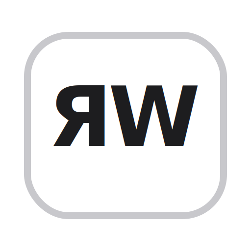

# Russian YaWERTY For macOS



This project contains a native macOS keyboard layout for a Russian `ЯВЕРТЫ` phonetic-style layout.

## Included

- `layouts/Russian-YaWERTY.keylayout`: the raw keyboard layout
- `assets/yaw-logo.svg`: source art for the repository logo and input-source icon
- `scripts/build_bundle.sh`: builds a macOS `.bundle` package with metadata and icon
- `install.sh`: builds and installs the bundle for the current user
- `uninstall.sh`: removes the installed bundle for the current user

## Main mapping

The top letter row is:

`Q W E R T Y U I O P [ ]` -> `я в е р т ы у и о п ш щ`

The home row is:

`A S D F G H J K L ; ' \`` -> `а с д ф г х й к л ; ' ч`

The bottom row is:

`Z X C V B N M , . /` -> `з ь ц ж б н м , . /`

Extra letters:

- `Option + \`` -> `ё`
- `Option + Shift + \`` -> `Ё`
- `Option + '` -> `ъ`
- `Option + Shift + '` -> `Ъ`

## Install

Run:

```bash
./install.sh
```

Then:

1. Log out of macOS and log back in.
2. Open `System Settings > Keyboard > Input Sources`.
3. Click `Edit` or `+`.
4. Find `Russian - ЯВЕРТЫ` under custom layouts / others and add it.

## Uninstall

Run:

```bash
./uninstall.sh
```

Then remove `Russian - ЯВЕРТЫ` from `System Settings > Keyboard > Input Sources` if it still appears, and log out and back in or restart macOS.

## Caps Lock Classification Test

The install now uses a `.bundle` package instead of only a plain `.keylayout`.
That bundle declares:

- intended language: `ru`
- Caps Lock language switching capable: `true`

This is the best built-in signal macOS exposes for custom keyboard layouts. It may improve how the layout is classified by the system, but Apple does not guarantee that custom layouts get the same Caps Lock behavior as built-in non-Latin input methods.

## Icon

The bundle includes a generated `.icns` icon based on the `ЯW` mark, so the input menu should show a custom icon instead of the generic keyboard icon.

All on-disk filenames are ASCII/English-only:

- `Russian-YaWERTY.bundle`
- `Russian-YaWERTY.keylayout`
- `Russian-YaWERTY.icns`

## Notes

- This layout targets ANSI Mac keyboards.
- Digits and common US punctuation stay in their usual places.
- Caps Lock uppercases Cyrillic letters.
