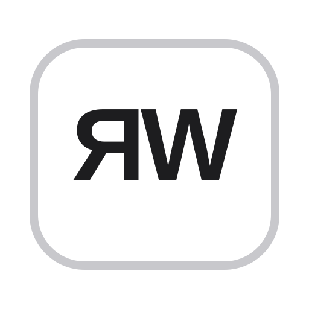

# Russian YaWERTY For macOS



This project contains a native macOS keyboard layout for a Russian `ЯВЕРТЫ` phonetic-style layout.

## Main mapping

The top letter row is:

`Q W E R T Y U I O P [ ]` -> `я в е р т ы у и о п ш щ`

The home row is:

`A S D F G H J K L ; '` -> `а с д ф г х й к л ; '`

The bottom row is:

`Z X C V B N M , . /` -> `з ь ц ж б н м , . /`

Extra keys and letters:

- `` ` `` -> `ю`
- `=` -> `ч`
- `\` -> `э`
- `Shift + \`` -> `Ю`
- `Shift + =` -> `Ч`
- `Shift + \` -> `Э`
- `Option + 6` -> `ё`
- `Option + Shift + 6` -> `Ё`
- `Option + '` -> `ъ`
- `Option + Shift + '` -> `Ъ`

## ASCII layout

```text
┌────┬────┬────┬────┬────┬────┬────┬────┬────┬────┬────┬────┬────┬────┐
│ `  │ 1  │ 2  │ 3  │ 4  │ 5  │ 6  │ 7  │ 8  │ 9  │ 0  │ -  │ =  │ \  │
│ Ю  │ 1  │ 2  │ 3  │ 4  │ 5  │ Ё  │ 7  │ 8  │ 9  │ 0  │ -  │ Ч  │ Э  │
├────┴──┬─┴──┬─┴──┬─┴──┬─┴──┬─┴──┬─┴──┬─┴──┬─┴──┬─┴──┬─┴──┬─┴──┬─┴────┤
│ Tab   │ Q  │ W  │ E  │ R  │ T  │ Y  │ U  │ I  │ O  │ P  │ [  │ ]    │
│       │ Я  │ В  │ Е  │ Р  │ Т  │ Ы  │ У  │ И  │ О  │ П  │ Ш  │ Щ    │
├───────┴┬───┴┬───┴┬───┴┬───┴┬───┴┬───┴┬───┴┬───┴┬───┴┬───┴┬───┴──────┤
│ Caps   │ A  │ S  │ D  │ F  │ G  │ H  │ J  │ K  │ L  │ ;  │ '       │
│        │ А  │ С  │ Д  │ Ф  │ Г  │ Х  │ Й  │ К  │ Л  │ ;  │ '       │
├────────┴─┬──┴─┬──┴─┬──┴─┬──┴─┬──┴─┬──┴─┬──┴─┬──┴─┬──┴─┬──┴──────────┤
│ Shift    │ Z  │ X  │ C  │ V  │ B  │ N  │ M  │ ,  │ .  │ /          │
│          │ З  │ Ь  │ Ц  │ Ж  │ Б  │ Н  │ М  │ ,  │ .  │ /          │
└──────────┴────┴────┴────┴────┴────┴────┴────┴────┴────┴────────────┘
```

## Install

Run:

```bash
./install.sh
```

Then:

1. Log out and back in, or restart macOS.
2. Open `System Settings > Keyboard > Input Sources`.
3. Click `Edit` or `+`.
4. Add `Russian - ЯВЕРТЫ`.
5. If an older broken install exists, remove it first from `~/Library/Keyboard Layouts/` and then log out/in or restart before reinstalling.

## Uninstall

Run:

```bash
./uninstall.sh
```

Then remove `Russian - ЯВЕРТЫ` from `System Settings > Keyboard > Input Sources` if it still appears, and log out and back in or restart macOS.

## Notes

- This layout targets ANSI Mac keyboards.
- Digits and common US punctuation stay in their usual places.
- Standard macOS shortcuts are preserved while Russian input is active.
- Caps Lock uppercases Cyrillic letters.
